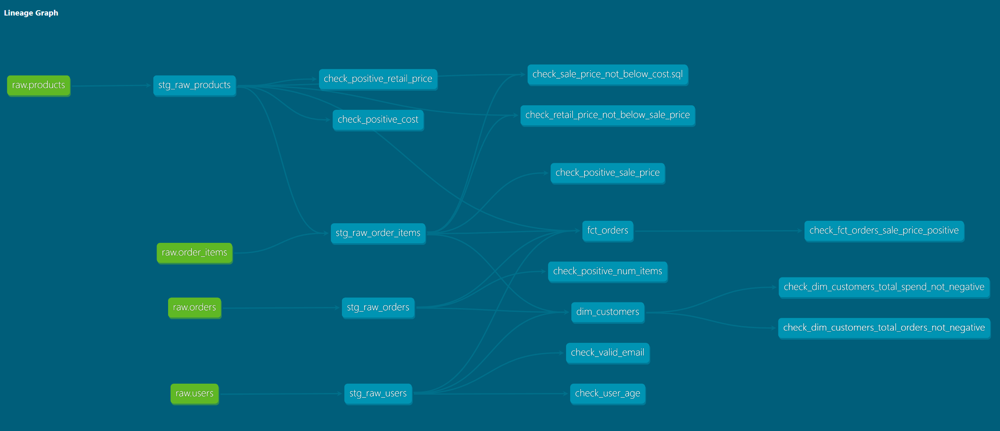

# E-Commerce Sales Intelligence Pipeline

An end-to-end data pipeline built on **Terraform -> GCS -> BigQuery -> dbt -> Python**, analysing the [TheLook E-Commerce](https://console.cloud.google.com/marketplace/product/bigquery-public-data/thelook-ecommerce) public dataset. The project demonstrates production data engineering practices: infrastructure-as-code, modular ingestion via GCS, layered dbt transforms, analytical notebooks, and automated HTML reporting.

---

## Problem Statement

Retail businesses generate large volumes of transactional data across orders, customers, and products but raw tables alone don't answer business questions. This pipeline transforms raw TheLook data into an analytical mart layer and answers:

- Which product categories and departments drive the most revenue?
- How has monthly revenue trended, and what does MoM growth look like?
- Which countries and acquisition channels generate the most value?
- What does the customer LTV distribution look like, and how concentrated is revenue?
- How well do customer cohorts retain over time?

---

## Architecture

```
┌─────────────────────────────────────────────────────────────────────┐
│                     INFRASTRUCTURE (Terraform)                      │
│   GCS bucket · BigQuery datasets (raw, staging, marts)              │
│   Service account + IAM bindings                                    │
└────────────────────────────┬────────────────────────────────────────┘
                             │  terraform apply
                             ▼
┌─────────────────────────────────────────────────────────────────────┐
│                        DATA SOURCE                                  │
│   bigquery-public-data.thelook_ecommerce                            │
│   (orders · order_items · users · products)                         │
└────────────────────────────┬────────────────────────────────────────┘
                             │  fetch_bigquery_data()
                             ▼
┌─────────────────────────────────────────────────────────────────────┐
│                     STAGING AREA (GCS)                              │
│   gs://career-practice-ecommerce-data-bucket/                       │
│   orders.parquet · order_items.parquet                              │
│   users.parquet  · products.parquet                                 │
└────────────────────────────┬────────────────────────────────────────┘
                             │  load_into_gcs_bucket()
                             │  load_gcs_to_bigquery()
                             ▼
┌─────────────────────────────────────────────────────────────────────┐
│                       RAW LAYER (BigQuery)                          │
│   career-practice.raw.*                                             │
│   raw_orders · raw_order_items · raw_users · raw_products           │
└────────────────────────────┬────────────────────────────────────────┘
                             │  dbt run
                             ▼
┌──────────────────────────────────────────────────────────────────────┐
│                    STAGING LAYER (dbt views)                         │
│   career-practice.staging.*                                          │
│                                                                      │
│   stg_raw_orders       cast IDs to STRING, filter null order_id      │
│   stg_raw_order_items  cast IDs, inner join to products, filter nulls│
│   stg_raw_users        cast ID, build full_name, QUALIFY dedup       │
│   stg_raw_products     cast ID, COALESCE null brands, filter nulls   │
└────────────────────────────┬─────────────────────────────────────────┘
                             │  dbt run
                             ▼
┌──────────────────────────────────────────────────────────────────────┐
│                      MART LAYER (dbt tables)                         │
│   career-practice.marts.*                                            │
│                                                                      │
│   fct_orders       one row per order item; joins all four staging    │
│                    models; item_status + order_status as separate    │
│                    fields; product, cost, traffic dimensions         │
│                                                                      │
│   dim_customers    one row per customer: total_spend, total_orders,  │
│                    avg_order_value, first/last order date,           │
│                    days_since_last_order; spend filters to           │
│                    Complete/Shipped; COALESCE zeroes for             │
│                    never-ordered customers                           │
└────────────────────────────┬─────────────────────────────────────────┘
                             │  google-cloud-bigquery SDK
                             ▼
┌─────────────────────────────────────────────────────────────────────┐
│                       ANALYSIS LAYER                                │
│   jupyter_analysis/analysis.ipynb                                   │
│                                                                     │
│   · Revenue & product performance    · Profitability by category    │
│   · Monthly trend + MoM growth %     · Order status breakdown       │
│   · Geography & acquisition          · Customer LTV distribution    │
│   · Cohort retention heatmap         · Revenue concentration        │
│                                                                     │
│     Exports: sales_intelligence_report.html  (Jinja2 + base64)      │
└─────────────────────────────────────────────────────────────────────┘
```

### dbt DAG Lineage



---

## Project Structure

```
.
├── dbt/
│   └── ecommerce_pipeline/
│       ├── models/
│       │   ├── staging/
│       │   │   ├── sources.yml
│       │   │   ├── schema.yml
│       │   │   ├── stg_raw_orders.sql
│       │   │   ├── stg_raw_order_items.sql
│       │   │   ├── stg_raw_products.sql
│       │   │   └── stg_raw_users.sql
│       │   ├── intermediate/
│       │   └── marts/
│       │       ├── fct_orders.sql
│       │       └── dim_customers.sql
│       ├── macros/
│       │   └── generate_schema_name.sql
│       ├── dbt_project.yml
│       └── packages.yml
├── jupyter_analysis/
│   └── analysis.ipynb
├── terraform/
│   ├── main.tf
│   ├── variables.tf
│   └── .gitignore
├── ingest.py
├── pyproject.toml
├── uv.lock
├── .python-version
├── .env                    # not committed
├── .gitignore
└── README.md
```

---

## Setup

### Prerequisites

- Python 3.13
- [uv](https://github.com/astral-sh/uv)
- [dbt-bigquery](https://docs.getdbt.com/docs/core/connect-data-platform/bigquery-setup)
- [Terraform](https://developer.hashicorp.com/terraform/install) >= 0.12
- A Google Cloud project with BigQuery and GCS APIs enabled

### 1. Clone the repo

```bash
git clone https://github.com/AndreGiancarloLu/E-Commerce-Sales-Intelligence-Pipeline.git
cd ecommerce-pipeline
```

### 2. Provision infrastructure with Terraform

```bash
cd terraform
terraform init
terraform apply
```

This creates:
- GCS bucket (`career-practice-ecommerce-data-bucket`)
- BigQuery datasets: `raw`, `staging`, `marts`
- Service account `ecommerce-pipeline-sa` with the required IAM roles
- Downloads the service account key (output as `service_account_key`)

Save the key output to `terraform/service-account-key.json`:

```bash
terraform output -raw service_account_key > service-account-key.json
```

### 3. Configure environment variables

Create a `.env` file in the project root:

```bash
BQ_PROJECT=career-practice
GCS_BUCKET_NAME=career-practice-ecommerce-data-bucket
GOOGLE_APPLICATION_CREDENTIALS=terraform/service-account-key.json
```

> **Never commit this file or the service account key.** Both are listed in `.gitignore`.

### 4. Install Python dependencies

```bash
uv sync
```

### 5. Run ingestion

```bash
uv run python ingest.py
```

This runs three steps for each of the four source tables (`orders`, `order_items`, `users`, `products`):
1. `fetch_bigquery_data()` queries `bigquery-public-data.thelook_ecommerce` and returns a DataFrame
2. `load_into_gcs_bucket()` serialises to Parquet and uploads to GCS
3. `load_gcs_to_bigquery()` loads from the GCS URI into `career-practice.raw.*`

### 6. Run dbt transforms

```bash
cd dbt/ecommerce_pipeline
dbt deps
dbt run
dbt test
```

### 7. Run the analysis notebook

```bash
cd jupyter_analysis
uv run jupyter lab
```

Or execute headlessly to regenerate `sales_intelligence_report.html`:

```bash
uv run jupyter nbconvert --to notebook --execute jupyter_analysis/analysis.ipynb
```

---

## dbt Models

### Staging (materialised as views)

| Model | Description |
|---|---|
| `stg_raw_orders` | Cast `order_id` and `user_id` to STRING, filter null `order_id` |
| `stg_raw_order_items` | Cast IDs to STRING, inner join to `stg_raw_products` to drop items with no matching product, filter null `id` |
| `stg_raw_users` | Cast `id` to STRING, concatenate `first_name` + `last_name` into `full_name`, deduplicate with `QUALIFY ROW_NUMBER()` keeping latest record per user |
| `stg_raw_products` | Cast `id` to STRING, `COALESCE(brand, 'Unknown')` for null brands, filter null `id` and `name` |

### Marts (materialised as tables)

| Model | Description |
|---|---|
| `fct_orders` | One row per order item, joining all four staging models; exposes both `item_status` and `order_status` as separate fields alongside product, cost, and customer/traffic dimensions |
| `dim_customers` | One row per customer: `total_spend`, `total_orders`, `avg_order_value`, `first_order_date`, `last_order_date`, `days_since_last_order`; spend metrics filter to Complete/Shipped items only via the staging join; never-ordered customers included with COALESCE zeroes |

---

## Key Findings

| Area | Finding |
|---|---|
| **Product** | Outerwear & Coats + Jeans are the top two revenue categories |
| **Growth** | Consistent upward revenue trend 2019–2026, accelerating sharply in 2025–2026 |
| **Operations** | ~25% of order items are cancelled or returned |
| **Geography** | China + US account for the majority of realised revenue |
| **Acquisition** | Search drives 70%+ of revenue volume; all channels produce near-identical avg LTV (~$72–75) |
| **Customers** | 47% of the customer base has zero realised spend; 63% of ordering customers have churned |
| **Retention** | Month-1 retention improved from 4–7% (2024) to 12–20% (early 2026) |
| **Concentration** | Top 10% of customers account for 50.71% of total revenue |

---

## Planned Enhancements

-  **LLM executive summary** replace static summary with Anthropic API-generated narrative keyed to actual metric values
-  **FastAPI endpoint** trigger the full pipeline on demand via HTTP POST
-  **LangChain Q&A** natural language questions over the sales data
-  **Make.com automation** weekly pipeline run with automated HTML report delivery

---

## Tech Stack

| Layer | Technology |
|---|---|
| Infrastructure | Terraform · Google Cloud |
| Storage | Google Cloud Storage (Parquet staging) |
| Cloud warehouse | Google BigQuery |
| Ingestion | Python · `google-cloud-bigquery` · `google-cloud-storage` |
| Transform | dbt Core · `dbt-bigquery` |
| Analysis | Pandas · Matplotlib · Seaborn |
| Reporting | Jinja2 · base64-embedded HTML |
| Dependency management | uv · `pyproject.toml` |

---

## Data Source

[`bigquery-public-data.thelook_ecommerce`](https://console.cloud.google.com/marketplace/product/bigquery-public-data/thelook-ecommerce) a synthetic fashion retail dataset provided by Google. Free to query with no billing required beyond standard BigQuery on-demand pricing (the dataset fits well within the free tier for this analysis).
